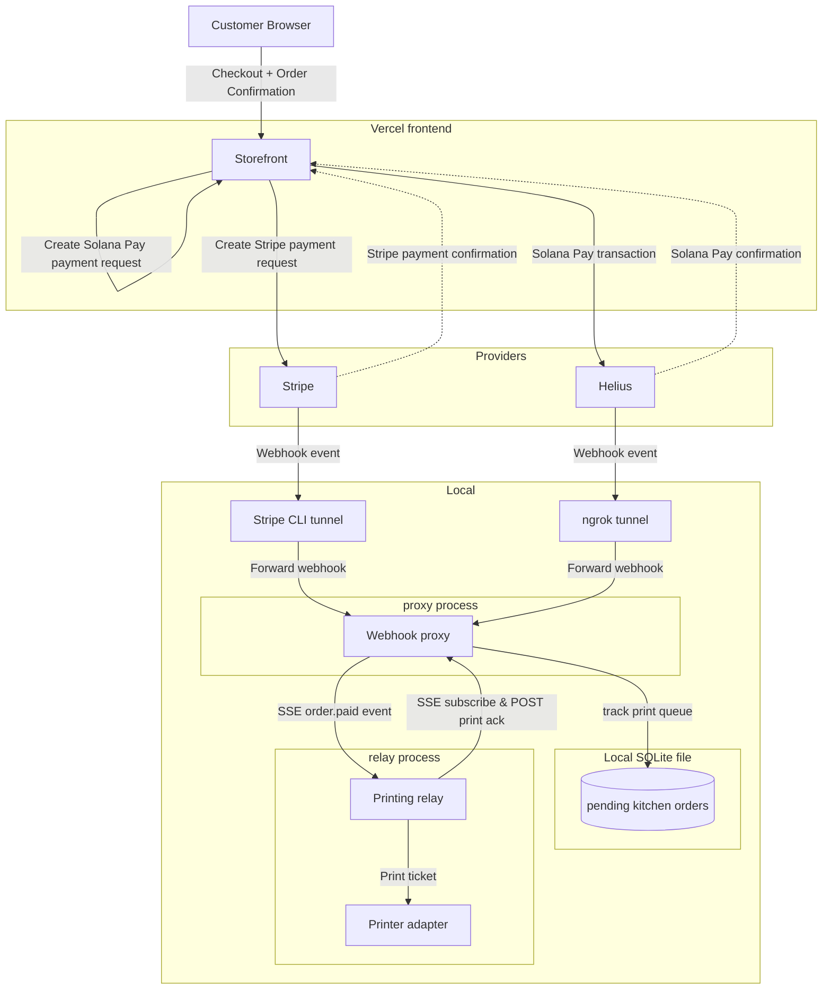
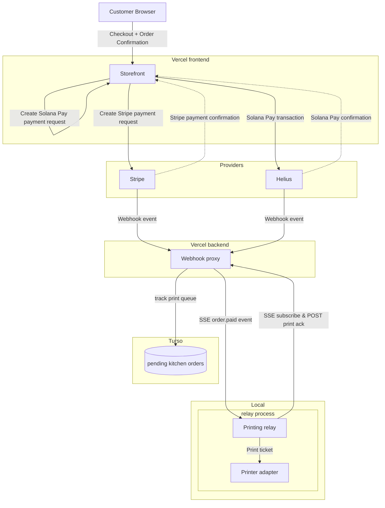

# RicoS

Monorepo for **RicoS** restaurant ordering: a **Next.js** storefront with **Stripe** Payment Element (guest checkout), a **kitchen-relay** service that prints paid orders from **Stripe webhooks**, and shared **menu data** with stable opaque item IDs.

**Package manager: [Bun](https://bun.sh) only.** The repo uses `bun.lock`. Do not run `npm install`, `yarn`, or `pnpm` — installs are blocked by a root `preinstall` hook unless you bypass it (don’t).

## Layout

| Path | Description |
|------|-------------|
| [`web/`](web/) | Next.js App Router — menu, cart, checkout, confirmation |
| [`kitchen-relay/`](kitchen-relay/) | Express server — `POST /webhook` for Stripe, prints ticket to stdout / optional log file |
| [`packages/shared/`](packages/shared/) | Canonical `menu.json` and helpers (`getItemById`, etc.) |

## Prerequisites

- **[Bun](https://bun.sh)** 1.2+ (`bun --version`)
- **Stripe** account (test mode for local development)
- **Stripe CLI** for forwarding webhooks to localhost ([install](https://stripe.com/docs/stripe-cli))

## Environment variables

See [`.env.example`](.env.example) and [`.env.local.example`](.env.local.example).

**Root env loading policy: `.env` then `.env.local`**

Create env files at the repository root:

- `.env` for shared defaults (safe values only; may be committed if non-secret)
- `.env.local` for secrets and machine-specific overrides (gitignored)

Root Bun scripts load `.env` first, then `.env.local`, so local values override defaults.

- `STRIPE_SECRET_KEY` — server-only; used by Route Handlers to create PaymentIntents (`.env.local`)
- `NEXT_PUBLIC_STRIPE_PUBLISHABLE_KEY` — public key for Stripe.js (`.env.local`)

**Kitchen relay** (reads from root `.env` and `.env.local` via root scripts):

- `STRIPE_SECRET_KEY` — same secret key (`.env.local`)
- `STRIPE_WEBHOOK_SECRET` — signing secret from the webhook endpoint you configure (see below, `.env.local`)

Optional:

- `KITCHEN_PRINT_LOG` — if set, append each ticket to this file (e.g. `./kitchen-print.log`, can be in `.env` or `.env.local`)
- `KITCHEN_RELAY_PORT` — default `4000` (in `.env` by default)

## Local development (v1)

1. **Install dependencies** (from repo root):

   ```bash
   bun install
   ```

2. **Configure env files**:

   - Copy `.env.example` to `.env` at the repo root.
   - Copy `.env.local.example` to `.env.local` at the repo root.
   - Fill real Stripe values in `.env.local`.

3. **Start the kitchen relay** (terminal 1):

   ```bash
   bun run dev:kitchen
   ```

   Set `STRIPE_WEBHOOK_SECRET` for the relay. For local CLI forwarding, run Stripe listen (step 5) and use the **`whsec_...`** secret it prints.

4. **Start the storefront** (terminal 2):

   ```bash
   bun run dev:web
   ```

   Open [http://localhost:3000](http://localhost:3000), add items, complete checkout with a [Stripe test card](https://stripe.com/docs/testing#cards) (e.g. `4242 4242 4242 4242`).

5. **Forward webhooks to the relay** (terminal 3):

   ```bash
   stripe listen --forward-to http://localhost:4000/webhook
   ```

   Paste the webhook signing secret into `STRIPE_WEBHOOK_SECRET` for `kitchen-relay` and restart the relay if needed. When a payment succeeds, the relay logs a kitchen ticket (and appends to `KITCHEN_PRINT_LOG` if set).

## Deploying the storefront on Vercel

- Connect the repo and set the **root directory** to `web` **or** deploy from the monorepo root with the appropriate app directory (your Vercel project settings).
- Set **Install Command** to `bun install` (and ensure the project uses Bun) so Vercel does not default to npm.
- Add `STRIPE_SECRET_KEY` and `NEXT_PUBLIC_STRIPE_PUBLISHABLE_KEY` in the Vercel project **Environment Variables**.
- The **kitchen relay is not deployed here** in v1; it is intended to run on **localhost** for development and later on a **Raspberry Pi** (or similar always-on host) with a public HTTPS URL for Stripe webhooks and a real printer adapter when you are ready.

## Kitchen relay on a Raspberry Pi (later)

- Run the same `kitchen-relay` process under **systemd** (or another supervisor).
- Create a **live** webhook endpoint in the [Stripe Dashboard](https://dashboard.stripe.com/webhooks) pointing to `https://your-pi-or-tunnel/webhook` and set `STRIPE_WEBHOOK_SECRET` to that endpoint’s signing secret.
- Replace or extend the print layer in [`kitchen-relay/src/print.ts`](kitchen-relay/src/print.ts) for USB or network thermal printers (e.g. ESC/POS) as needed.

## Menu item IDs

Cart and API payloads use human-readable generic IDs (`item_...`, `cat_...`, `mod_...`, `opt_...` in `packages/shared/src/menu.json`). Keep IDs stable even if display copy changes.

## Predefined customizations (v1)

- Modifier groups are modeled in shared menu data and validated server-side.
- `cat_breakfast_griddles` requires two single-select groups on each line item:
  - Base choice: `(2) Pancakes` or `(1) Waffles` or `(2) French Toast`
  - Side choice: `Sausage` or `jamón` or `bacon`
- `item_western_omelette` (Western Omelette) includes a multi-select subtractive group:
  - `no tomate`, `no cebolla`, `no pimientos`, `no queso`

### Cart / checkout payload shape

- Cart lines are sent as:
  - `{ id: string, quantity: number, selections: { [modifierGroupId]: string[] } }`
- Server validation rejects:
  - unknown groups/options
  - missing required selections
  - invalid single-vs-multiple selection counts

### Stripe metadata shape

- PaymentIntent metadata stores one JSON-encoded line per index:
  - `line_count=<n>`
  - `line_0={"i":"<itemId>","q":<qty>,"s":{"<groupId>":["<optionId>"]}}`
- Kitchen relay parses this structure and resolves IDs to printable labels.
- This is v1; old metadata formats are intentionally not supported.

## Scripts (root `package.json`)

| Script | Command |
|--------|---------|
| Dev — web | `bun run dev:web` |
| Dev — kitchen | `bun run dev:kitchen` |
| Build — web | `bun run build` |
| Lint — web | `bun run lint` |

Run root scripts (`bun run dev:web`, `bun run dev:kitchen`, etc.) so root `.env` and `.env.local` are always loaded in the correct order.

## Architecture

### Current approach (portable prototype)

The host device runs two local processes: a **webhook proxy** and a **printing relay**. The proxy receives provider webhooks (Stripe, Helius) through **local tunnels**, verifies and normalizes them, **writes paid orders into SQLite** (`pending kitchen orders`), and pushes **`order.paid`** to the relay over **SSE**. The relay **subscribes over SSE**, sends **POST print ack** when a ticket is done, and handles **retries, idempotency, and dead-letter** at the printer. That keeps payment ingress and queue state in the proxy and keeps execution at the printer, with low cost for prototyping.

**Diagram convention (current and ideal):** Both figures show **one** storage shape—**pending kitchen orders**—inside a **deployment boundary** (local SQLite file vs hosted Turso). They **omit** a separate box for the **database engine** or **`@libsql/client`**; that code runs **inside** the webhook proxy process. The engine is always **libSQL-oriented**: **`@libsql/client`** with a **`file:`** URL on the proxy host today, and the **same package** with Turso’s **URL + token** after migration—so the drawing stays about **where the queue lives**, not library internals.



### Ideal approach (robust)

Provider webhooks hit the **Vercel** backend directly (no local tunnels). The same role as the portable **webhook proxy** lives in **Route Handlers**: verify Stripe and Helius payloads, normalize `order.paid`, **track the print queue** in **hosted Turso** (libSQL / SQLite-compatible), and expose **SSE plus POST print ack** from the same deployment. Nothing durable lives on the Vercel instance’s own filesystem; the queue is **offloaded to Turso** so work survives deploys and cold starts. The on-prem host runs only the **printing relay**; it uses the same **SSE subscribe and POST print ack** pattern against **Vercel** instead of the local proxy.

Route Handlers talk to **pending kitchen orders** through **`@libsql/client`** and Turso’s **HTTPS URL + token**; see **Diagram convention** under *Current approach* for why the drawing matches that stack without an extra “Turso API” node.



### Migration (current → ideal)

This migration moves **webhook receipt** from an **on-prem host** (with tunnels) to **Vercel**. The **kitchen printer** stays at the shop. The rest follows from that split.

#### Unchanged

- Customers still check out in the **Vercel storefront**.
- Stripe and Helius still decide what “paid” means on their side.
- The **printing relay** still drives the printer, retries failed prints, and dedupes to prevent duplicate tickets.

#### What actually changes

- **Webhooks:** Stripe and Helius stop calling ngrok / Stripe CLI. They call the **Vercel deployment’s public HTTPS URL** instead.
- **The local webhook proxy goes away.** Its work (check signatures, turn provider JSON into one clean “order paid” message) moves into **Vercel route handlers**.
- **The printing relay still listens over SSE.** Only the **SSE server address** changes from “local proxy” to “Vercel.” The relay still opens the connection from inside the shop network, which avoids router port forwarding.

#### Why the cloud adds a small database

- Vercel workers **start and stop**; RAM does not survive as a reliable queue.
- On each webhook, the handler **persists the normalized order in cloud storage** (a tiny table is enough), **then** returns success to Stripe.
- A paid order stays **on record** if the kitchen PC is off or Wi-Fi drops. SSE then **notifies the relay of orders already persisted**, instead of depending on the relay being online at webhook time.

#### Easiest storage story (optional)

- **SQLite file** on the proxy machine today, **Turso** (hosted SQLite-style) on Vercel later: same idea, mostly **connection string** changes.

#### Cutover (in order)

1. Build Vercel webhooks + cloud persistence + SSE; test with Stripe and Helius test hooks.
2. Point Stripe and Helius production webhooks at Vercel; point the relay SSE at Vercel.
3. Retire the local proxy and tunnels once a short soak period shows stable delivery.
4. Migrate undelivered rows only when they still exist; otherwise cut over with an empty cloud outbox after the local queue is drained.
