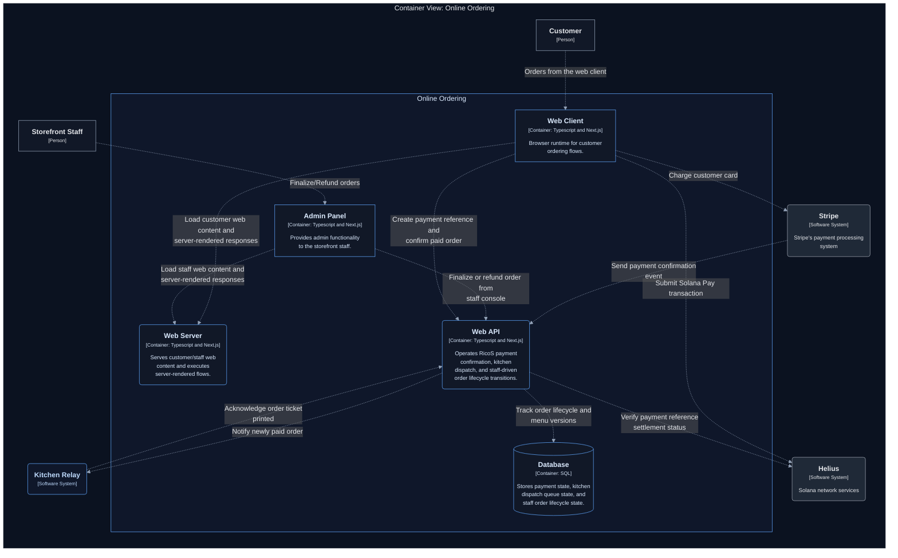

# RicoS

Monorepo for RicoS online ordering.

- `web`: Next.js storefront + API routes (Stripe checkout, Solana polling confirmation, staff menu publish)
- `kitchen-relay`: Bun relay that consumes `order.paid` events and prints kitchen tickets
- `packages/shared`: Canonical menu and shared cart/menu utilities

## Current Runtime State

- Package manager is **Bun only** (`bun.lock` + install guard in root `preinstall`)
- Stripe and Helius webhook routes exist in `web`
- Solana order confirmation currently uses backend polling as primary ingestion

## Prerequisites

- **Bun** `>= 1.2.0` (Bun-only installs)
- **Turso** — DB + auth token (`TURSO_DATABASE_*`)
- **Stripe** — API keys + `STRIPE_WEBHOOK_SECRET`
- **Solana Pay** — `HELIUS_USDC_MINT`, `HELIUS_MERCHANT_RECIPIENT`, and `NEXT_PUBLIC_SOLANA_RPC_URL` on the same cluster
- **Kitchen relay** — `console` only needs Bun; `lp` needs CUPS (see `.env.example`)

## Environment

Copy and fill:

- `.env.example` -> `.env`
- `.env.local.example` -> `.env.local`

Root scripts load env in this order: `.env` then `.env.local` (local overrides shared defaults).

Core vars to set:

- `STRIPE_SECRET_KEY`
- `NEXT_PUBLIC_STRIPE_PUBLISHABLE_KEY`
- `STRIPE_WEBHOOK_SECRET`
- `TURSO_DATABASE_URL`
- `TURSO_DATABASE_AUTH_TOKEN`
- `HELIUS_USDC_MINT`
- `HELIUS_MERCHANT_RECIPIENT`
- `KITCHEN_RELAY_PORT`
- `KITCHEN_PRINTER_ADAPTER`

Menu publish vars:

- `MENU_PUBLISH_MENU_JSON_URL` (raw GitHub URL to `main/packages/shared/src/menu.json`)
- `STAFF_MENU_PUBLISH_SECRET`
- `GITHUB_TOKEN` (only if the menu repo is private)

Optional vars are documented in `.env.example` and `.env.local.example`.

## Local Development

1. Install dependencies:
   ```bash
   bun install
   ```
2. Configure `.env` and `.env.local` from examples.
3. Start both processes:
   - Cursor task: `RicoS: Dev bootstrap`
   - Shell:
     ```bash
     bun run dev:web
     bun run dev:kitchen
     ```
4. Open [http://localhost:3000](http://localhost:3000) and run checkout with Stripe test card `4242 4242 4242 4242`.

## Root Scripts

- `bun run dev:bootstrap`
- `bun run dev:web`
- `bun run dev:kitchen`
- `bun run build`
- `bun run lint`

## Deploying `web` on Vercel

- Configure project to build with Bun (`bun install`)
- Set env vars used by `web` (Stripe, Turso, Solana, menu publish vars)
- Keep `kitchen-relay` deployed separately (on-prem/supervised host)

## Kitchen Relay (On-Prem)

- Run `kitchen-relay` under a supervisor (for example `systemd`)
- Point `KITCHEN_BACKEND_BASE_URL` to hosted `web`
- If using print ack auth, set matching `PRINT_ACK_SECRET` in `web` and relay
- Extend printing behavior in `kitchen-relay/src/component/ticket-printing/service.ts` as needed

## Menu Publish Workflow

Source of truth:

- Runtime menu is stored in Turso `menu_versions` (active version = max `version`)
- Git canonical file is `packages/shared/src/menu.json`

Operational flow:

1. Update `packages/shared/src/menu.json` and increment `catalogVersion` by exactly `+1`.
2. Merge to `main`.
3. After production deploy success, GitHub workflow `.github/workflows/menu-publish.yml` posts to:
   - `POST /api/staff/menu/publish`
   - `Authorization: Bearer <STAFF_MENU_PUBLISH_SECRET>`
4. API validates and writes new version when content changes.

Required workflow setup:

- Set `PUBLISH_URL` in `.github/workflows/menu-publish.yml`
- Add repo secret `STAFF_MENU_PUBLISH_SECRET` matching Vercel env

Manual fallback:

- Call `POST /api/staff/menu/publish` directly with bearer secret.

Checkout guard:

- Clients send `menuVersionSeen`; backend returns `409` on mismatch to force refresh.

## Architecture

See [C4 Model](docs/C4/workspace.dsl) for details.



