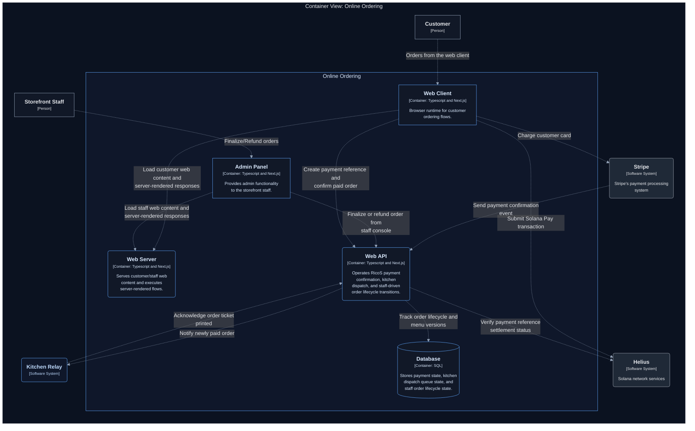

# RicoS

Monorepo for **RicoS** restaurant ordering: a **Next.js** storefront with **Stripe** Payment Element (guest checkout), backend routes in the `**web`** app that persist pending Solana payment references and poll chain confirmations into the `order.paid` queue, a **kitchen-relay** printing service that subscribes to that stream and prints tickets, and shared **menu data** with stable opaque item IDs.

**Webhook integration status:** Stripe and Helius webhook routes remain integrated and ready for use, but Solana order ingestion currently relies on backend polling and is not actively using webhook delivery.

**Package manager: [Bun](https://bun.sh) only.** The repo uses `bun.lock`. Do not run `npm install`, `yarn`, or `pnpm` — installs are blocked by a root `preinstall` hook unless you bypass it (don’t).

**Next.js lockfile patch noise (Bun incompatibility):** Next.js can try to auto-patch lockfiles and shell out to Yarn for registry resolution. In this Bun-only repo, that path can produce repeated Corepack/Yarn errors (for example, `packageManager: "bun@..."` parsing failures) even when builds succeed. To keep output clean and avoid false alarms, `web/package.json` sets `NEXT_IGNORE_INCORRECT_LOCKFILE=1` for `next dev` and `next build`.

## Layout


| Path                                   | Description                                                                                     |
| -------------------------------------- | ----------------------------------------------------------------------------------------------- |
| `[web/](web/)`                         | Next.js App Router — menu, cart, checkout, confirmation                                         |
| `[kitchen-relay/](kitchen-relay/)`     | Bun — SSE client + `GET /health`; prints tickets (console or CUPS) and POSTs ack to web backend |
| `[packages/shared/](packages/shared/)` | Canonical `menu.json`, cart codec, `createMenuCatalogSurface`, parse/hash helpers for publish       |


## Prerequisites

- **[Bun](https://bun.sh)** 1.2+ (`bun --version`)
- **Stripe** account (test mode for local development)
- **Stripe CLI** for forwarding webhooks to localhost ([install](https://stripe.com/docs/stripe-cli))

## Environment variables

See `[.env.example](.env.example)` and `[.env.local.example](.env.local.example)`.

**Root env loading policy: `.env` then `.env.local`**

Create env files at the repository root:

- `.env` for shared defaults (safe values only; may be committed if non-secret)
- `.env.local` for secrets and machine-specific overrides (gitignored)

Root Bun scripts load `.env` first, then `.env.local`, so local values override defaults.

- `STRIPE_SECRET_KEY` — server-only; used by storefront Route Handlers and webhook handlers (`.env.local`)
- `NEXT_PUBLIC_STRIPE_PUBLISHABLE_KEY` — public key for Stripe.js (`.env.local`)

**Webhook backend** (`web/` Route Handlers, root `.env` / `.env.local`):

- `STRIPE_SECRET_KEY` — Stripe API secret (`.env.local`)
- `STRIPE_WEBHOOK_SECRET` — signing secret from Stripe Dashboard webhook (`.env.local`)
- `WEBHOOK_PROXY_DATABASE_URL` — required Turso URL (`libsql://...` or `https://...`) in `.env`
- `WEBHOOK_PROXY_DATABASE_AUTH_TOKEN` — required Turso auth token in `.env.local`
- `MENU_PUBLISH_MENU_JSON_URL` — GitHub raw URL to `menu.json` on `main` (required for staff publish); see **Menu versioning & workflow**
- `STAFF_MENU_PUBLISH_SECRET` — Bearer secret for `POST /api/staff/menu/publish` (`.env.local`)
- `GITHUB_TOKEN` — optional PAT for private repo raw fetch used by publish (`.env.local`)
- `PRINT_ACK_SECRET` — optional shared secret; relay must send header `X-Print-Ack-Key` when set
- `HELIUS_USDC_MINT` — expected USDC mint in Solana Pay transfer parsing (`.env.local`)
- `HELIUS_MERCHANT_RECIPIENT` — expected merchant recipient wallet (`.env.local`)
- `SOLANA_POLL_INTERVAL_MS` — optional poll interval override for pending Solana references (default `2000`)
- `HELIUS_WEBHOOK_ENABLED` — optional toggle for webhook ingestion (`1` to enable, default disabled)
- `HELIUS_WEBHOOK_AUTH_HEADER_NAME` / `HELIUS_WEBHOOK_AUTH_HEADER_VALUE` — optional auth gate for webhook ingestion (`.env.local`)

**Kitchen relay** (printing only, root `.env` / `.env.local`):

- `KITCHEN_BACKEND_BASE_URL` — base URL of the web backend (default `http://127.0.0.1:3000`)
- `KITCHEN_WEBHOOK_PROXY_URL` — legacy fallback name (still supported)
- `KITCHEN_PRINTER_ADAPTER` — `console` or `lp` (required in `.env`)
- `PRINT_ACK_SECRET` — must match the web backend if it is set

Optional:

- `KITCHEN_PRINT_LOG` — if set, append each ticket to this file (e.g. `./kitchen-print.log`, can be in `.env` or `.env.local`)
- `KITCHEN_RELAY_PORT` — required in `.env` (use `4000` locally)

## Local development (v1)

1. **Install dependencies** (from repo root):
  ```bash
   bun install
  ```
2. **Configure env files**:
  - Copy `.env.example` to `.env` at the repo root.
  - Copy `.env.local.example` to `.env.local` at the repo root.
  - Fill real Stripe values in `.env.local`.
3. **Start backend + storefront** — **recommended in Cursor:** one integrated terminal per process.
  - Command Palette (**Cmd+Shift+P** / **Ctrl+Shift+P**) → **Tasks: Run Task** → `**RicoS: Dev bootstrap`**.  
   That starts **kitchen-relay** and **web** in separate terminal tabs (see `[.vscode/tasks.json](.vscode/tasks.json)`).  
   If tasks fail with `**bun: command not found`**, the workspace prepends `**~/.bun/bin**` (and common Homebrew paths) to `PATH` in `[.vscode/tasks.json](.vscode/tasks.json)` and `[.vscode/settings.json](.vscode/settings.json)`; reload the window after pulling changes. On Windows, add your Bun install directory to `PATH` or extend `.vscode/tasks.json` `options.env` with `;`-separated paths.
   **From a normal shell** (no split tabs): run the three commands in three terminals, or `bun run dev:bootstrap` for printed instructions (it does not multiplex one session).
   Set `STRIPE_WEBHOOK_SECRET` for the **web backend** in `.env.local`. Set `KITCHEN_PRINTER_ADAPTER` (e.g. `console`) in `.env`.
4. **Configure provider webhooks to hit hosted web routes**:
  - Stripe endpoint: `https://<your-web-domain>/api/webhooks/stripe`
  - Helius endpoint: `https://<your-web-domain>/api/webhooks/helius` (integration can remain configured while ingestion is disabled by default)
  - Relay SSE endpoint: `https://<your-web-domain>/api/events/stream`
  - Relay ack endpoint: `https://<your-web-domain>/api/print/ack`
   Solana Pay checkout now registers pending payment references on the backend; a poller confirms on-chain settlement and persists the order. The backend then emits `**order.paid`** over SSE; the relay prints a kitchen ticket (and appends to `KITCHEN_PRINT_LOG` if set).
5. Open [http://localhost:3000](http://localhost:3000), add items, complete checkout with a [Stripe test card](https://stripe.com/docs/testing#cards) (e.g. `4242 4242 4242 4242`).

## Deploying the storefront on Vercel

- Connect the repo and set the **root directory** to `web` **or** deploy from the monorepo root with the appropriate app directory (your Vercel project settings).
- Set **Install Command** to `bun install` (and ensure the project uses Bun) so Vercel does not default to npm.
- Add `STRIPE_SECRET_KEY` and `NEXT_PUBLIC_STRIPE_PUBLISHABLE_KEY` in the Vercel project **Environment Variables**.
- Add Turso vars, `MENU_PUBLISH_MENU_JSON_URL`, and `STAFF_MENU_PUBLISH_SECRET` (and `GITHUB_TOKEN` if the menu repo is private) so staff publish works in production.
- The **kitchen relay** remains on-prem; webhook handling now runs in the hosted `web` backend.

## Solana Pay (scalability)

Current ingestion is DB-backed polling for reliability. It is resilient to webhook delivery misses, but the naive cost model scales poorly:

- Each loop iteration scans active `pending_payments`.
- Each pending reference can trigger RPC lookups (`getSignaturesForAddress`, then `getTransaction` on match).
- Effective request rate grows with both poll frequency and queue depth (`requests/sec ~= pending * loops/sec` in worst case).

This means low-latency settings can quickly multiply RPC load as checkout concurrency rises.

### Optimization target

To approach webhook-like latency while keeping polling reliability, optimize around a bounded, indexed scan model instead of per-reference hot loops:

- Poll recent signatures from merchant-side activity windows (time/slot bounded) and map back to pending references.
- Batch or coalesce transaction detail fetches, and only fetch details for candidate signatures that can satisfy amount/mint/account constraints.
- Keep a short-lived in-memory signature cache (already-seen tx) to avoid repeated decode work.
- Use adaptive polling: fast cadence while queue is small/non-empty, slower cadence when queue is empty or backlog is large.
- Enforce hard concurrency and RPS caps per provider tier to prevent 429 storms.

Practical goal: maintain near-real-time confirmation for active checkouts while keeping RPC usage sub-linear relative to pending queue size.

## Kitchen relay host (on-prem)

- Run `**kitchen-relay`** under **systemd** (or another supervisor), with `KITCHEN_BACKEND_BASE_URL` pointing at your hosted web backend.
- Configure Stripe webhook to call hosted `web` route directly (`/api/webhooks/stripe`).
- Helius webhook can remain configured for future use, but Solana ingestion no longer uses webhook delivery by default.
- Replace or extend the print layer in `[kitchen-relay/src/print.ts](kitchen-relay/src/print.ts)` for USB or network thermal printers (e.g. ESC/POS) as needed.

## Menu item IDs

Cart and API payloads use human-readable generic IDs (`item_...`, `cat_...`, `mod_...`, `opt_...` in `[packages/shared/src/menu.json](packages/shared/src/menu.json)`). Keep IDs stable even if display copy changes.

## Menu versioning & workflow

**Where the live menu lives.** The storefront and new checkouts use the **active** row in Turso table `menu_versions` (the row whose `version` equals `MAX(version)`). That database is the runtime source of truth for catalog text, prices, modifier layout, and cart encoding.

**Canonical file in git.** `[packages/shared/src/menu.json](packages/shared/src/menu.json)` is the repo copy of the menu. It must include top-level release fields:

- `catalogVersion` — integer, must follow the monotonic publish rules below.
- `publishedAt` — ISO-8601 timestamp for that publish.

The rest of the file is the catalog (`restaurant`, `menuName`, `categories`, …).

**First-time database (empty `menu_versions`).** When the app first connects to an empty table, it **bootstraps** one row from the **bundled** `menu.json` shipped with that deployment (same path in `@ricos/shared`). No HTTP publish is required for that initial seed.

**After the table has any rows.** A **Vercel redeploy alone does not** insert or bump the menu in the database. The new `menu.json` in the build artifact is not applied to Turso until publish runs.

**Publishing updates to the DB (normal path).**

1. Merge changes to **`main`** so `[packages/shared/src/menu.json](packages/shared/src/menu.json)` reflects the desired catalog.
2. Set **`catalogVersion`** to the next integer: it must equal **current `MAX(version)` in Turso + 1** (the server rejects skips, duplicates, or overwrites of existing versions except hash-consistent no-ops).
3. Call **`POST /api/staff/menu/publish`** with header `Authorization: Bearer <STAFF_MENU_PUBLISH_SECRET>`.
4. The handler **fetches** the file from **`MENU_PUBLISH_MENU_JSON_URL`** (required), which should be the **GitHub raw URL** for `main`, e.g.  
   `https://raw.githubusercontent.com/<org>/<repo>/main/packages/shared/src/menu.json`  
   so production publish tracks **what is on `main`**, not whatever happens to be in a particular deployment bundle. For private repositories, set **`GITHUB_TOKEN`** (read access to the file).
5. The server validates the JSON, computes the **full-manifest** content hash (release fields + catalog), writes the row, refreshes decode caches, and revalidates the Next.js menu cache.

**Idempotent publish.** The DB column `catalog_json` holds **only** the menu document (`restaurant`, `menuName`, `categories`), not `catalogVersion` / `publishedAt`. Publish dedups on the **`categories` array only** — `restaurant` and `menuName` are fixed branding and are intentionally excluded from the idempotency decision. The handler `JSON.parse`s the active row's `catalog_json`, re-serializes its `categories` through **`canonicalJson`**, and compares to **`canonicalJson`** of `parsed.catalog.categories` from Git. Whitespace, key order, or non-canonical legacy/manual writes do not affect the result. If `categories` matches, the handler **does nothing** and responds with **`skipped: true`** and the current active `version`. Header-only edits (e.g. changing `restaurant`/`menuName` without touching items) are not supported and will be silently no-ops by design.

**Checkout policy.** Clients send **`menuVersionSeen`** (the version they loaded with the menu). If it does not match the active version in the DB, payment routes respond with **409** so users refresh and rebuild the cart. Past orders still decode using **historical** `menu_versions` rows keyed by the `menuVersion` stored in payment metadata.

**Operational standards.**

- Treat **`STAFF_MENU_PUBLISH_SECRET`** and **`GITHUB_TOKEN`** (if used) as production secrets; anyone with both the secret and a malicious `main` can push a bad catalog live.
- Prefer **branch protection** and review on `main` so the raw URL used by publish cannot surprise you.
- The **git history** of `menu.json` supports process review; **Turso `menu_versions`** (version, `published_at`, `content_hash`) is the audit trail for what was actually live for commerce.

Environment variable details: `[.env.local.example](.env.local.example)` (`MENU_PUBLISH_MENU_JSON_URL`, `STAFF_MENU_PUBLISH_SECRET`, optional `GITHUB_TOKEN`).

## Predefined customizations (v1)

- Modifier groups are modeled in shared menu data and validated server-side.
- `cat_breakfast_griddles` requires two single-select groups on each line item:
  - Base choice: `(2) Pancakes` or `(1) Waffles` or `(2) French Toast`
  - Side choice: `Sausage` or `jamón` or `bacon`
- `item_western_omelette` (Western Omelette) includes a multi-select subtractive group:
  - `no tomate`, `no cebolla`, `no pimientos`, `no queso`

### Cart / checkout payload shape

- Cart lines are sent as:
  - `{ id: string, quantity: number, selections: { [modifierGroupId]: string[] } }`
- Server validation rejects:
  - unknown groups/options
  - missing required selections
  - invalid single-vs-multiple selection counts

The on-wire shape of the cart inside Stripe metadata (codec identifier, base64url payload, binary byte layout, integrity checks) is decoded by Web API component logic in `web/lib/commerce/web-api/`* with supporting adapters in `web/lib/infrastructure/*`.

## Scripts (root `package.json`)


| Script                                      | Command                                                                                                           |
| ------------------------------------------- | ----------------------------------------------------------------------------------------------------------------- |
| Dev — bootstrap (split terminals in Cursor) | Command Palette → **Tasks: Run Task** → **RicoS: Dev bootstrap** (see `[.vscode/tasks.json](.vscode/tasks.json)`) |
| Dev — bootstrap hint (shell only)           | `bun run dev:bootstrap`                                                                                           |
| Dev — web                                   | `bun run dev:web`                                                                                                 |
| Dev — kitchen (printing relay)              | `bun run dev:kitchen`                                                                                             |
| Build — web                                 | `bun run build`                                                                                                   |
| Lint — web                                  | `bun run lint`                                                                                                    |


Run root scripts (`bun run dev:web`, `bun run dev:kitchen`, etc.) so root `.env` and `.env.local` are always loaded in the correct order.

## Architecture

See [C4 Model](docs/C4/workspace.dsl) for details.



