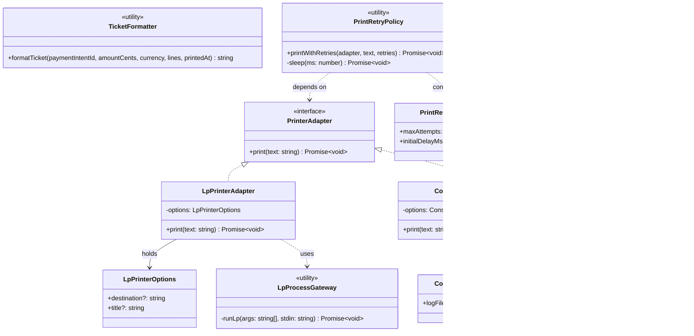

# Kitchen Relay — Ticket Printing (L4)

**Structurizr:** `kitchen.relay.ticket_printing`  
**Doc file (kebab-case):** `docs/UML/kitchen-relay-ticket-printing.md`

This UML class diagram documents the code-level printer abstraction implemented in `kitchen-relay/src/print.ts`.

